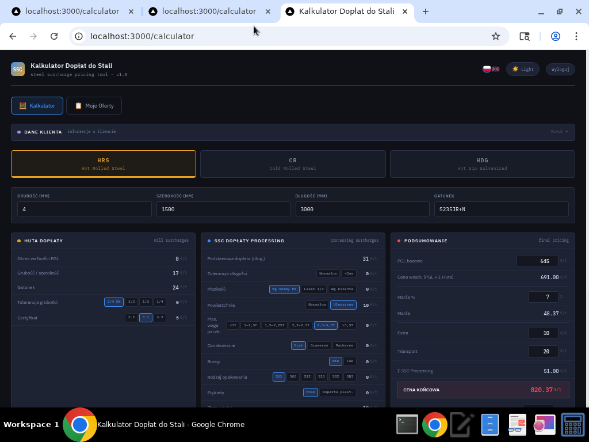
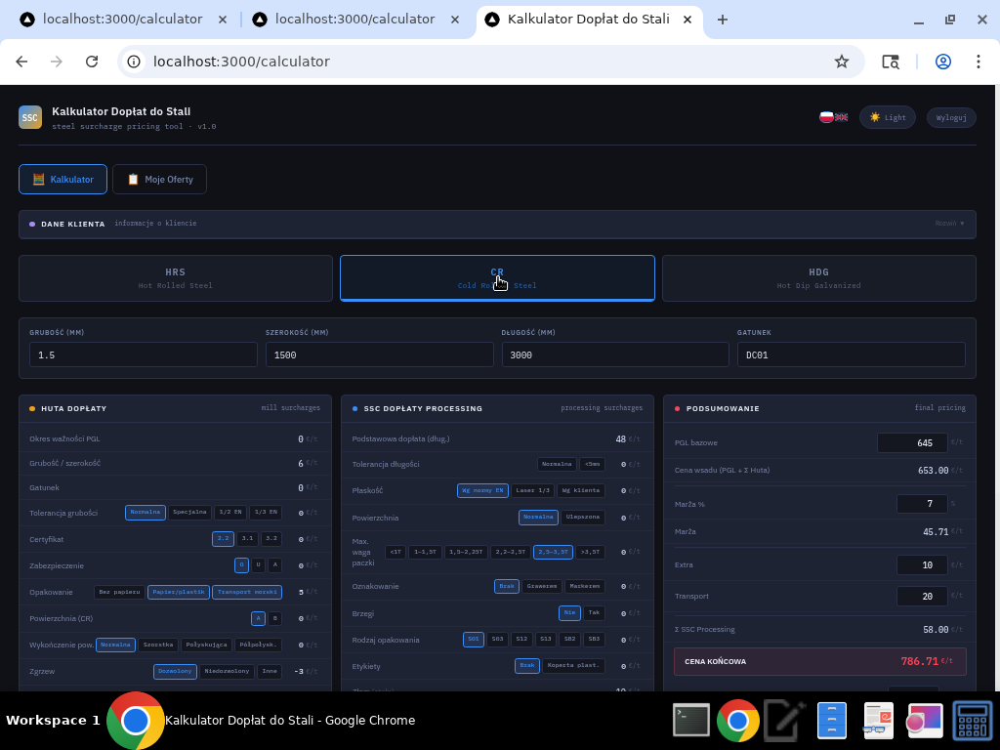
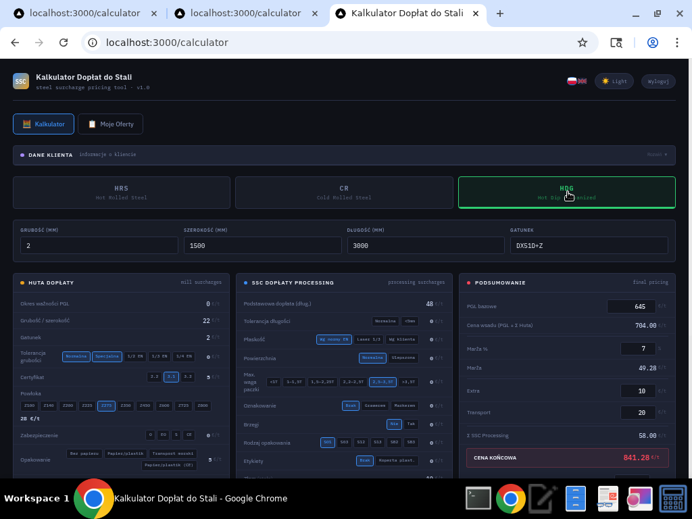

# SteelQuote

A web app for steel sales teams: calculate pricing (mill surcharges, processing
costs, margin, transport) for HRS, CR, and HDG steel in real time, save the
result as an offer, and export it to PDF for a client.





This repo has two implementations of the same idea, built at different points:

- **`finance_calculator/`** — the current version. Next.js 14 + plain
  PostgreSQL (`pg`) + JWT auth (`jose`, `bcryptjs`) + `jspdf` for PDF export.
  Lighter dependency footprint, custom auth.
- **`finance_calculator_deployed/nextjs_space/`** — an alternate build using
  Prisma + NextAuth for auth/sessions, with S3/Azure Blob storage wired in.
  Heavier, more "batteries-included" scaffold.

There's also a standalone prototype at the repo root (`index.html`,
`steel_calculator_standalone.html`) — a single-file version of the calculator
with no backend, useful for a quick look without installing anything.

## `finance_calculator/`

**Stack:** Next.js 14 (App Router), PostgreSQL, JWT sessions, jsPDF.

**Features:**
- Login backed by Postgres, passwords hashed with bcrypt, session as an
  httpOnly JWT cookie (24h expiry)
- Calculator page for HRS / CR / HDG pricing with live totals
- Offers: create, list, duplicate, delete, edit — stored per-user in Postgres
  as JSONB, with client info (name, company, NIP, address, contact) attached
- PDF export of an offer via jsPDF + jspdf-autotable

**Setup:**

```bash
cd finance_calculator
npm install
cp .env.example .env.local   # fill in DATABASE_URL and JWT_SECRET
psql "$DATABASE_URL" -f migrations/001_create_users_table.sql
psql "$DATABASE_URL" -f migrations/002_create_offers_table.sql
psql "$DATABASE_URL" -f migrations/003_add_client_info_to_offers.sql
npm run dev
```

Open [http://localhost:3000](http://localhost:3000). There's no signup route
yet — create a user manually, hashing the password with bcrypt:

```bash
node -e "console.log(require('bcryptjs').hashSync('yourpassword', 10))"
```

```sql
INSERT INTO users (email, password) VALUES ('you@example.com', '<hash from above>');
```

## `finance_calculator_deployed/nextjs_space/`

**Stack:** Next.js, Prisma, NextAuth, PostgreSQL, AWS S3 / Azure Blob storage.

**Setup:**

```bash
cd finance_calculator_deployed/nextjs_space
yarn install
cp .env.example .env   # fill in DATABASE_URL, NEXTAUTH_SECRET, ABACUSAI_API_KEY
npx prisma migrate deploy
npx prisma db seed
yarn dev
```

`ABACUSAI_API_KEY` is a deployment token for an Abacus.ai-hosted PDF
generation service used by `app/api/generate-pdf` — the plain
`finance_calculator/` app generates PDFs client-side with jsPDF instead and
doesn't need this.

## Notes

- Real `.env` files, a local Postgres data directory, and files generated
  from actually running the app locally (saved offer PDFs, uploads) are
  excluded via `.gitignore` — they're runtime state, not source code. Use the
  `.env.example` files as a starting point.
- Both apps currently run as separate, independent codebases rather than one
  merged app.

## Roadmap

- [ ] Settle on one implementation instead of two parallel ones
- [ ] Signup flow (currently users are created manually)
- [ ] Approval workflow (offer → supervisor review → client)
- [ ] Password reset via email
- [ ] Sales dashboard / offer history view

## License

MIT
